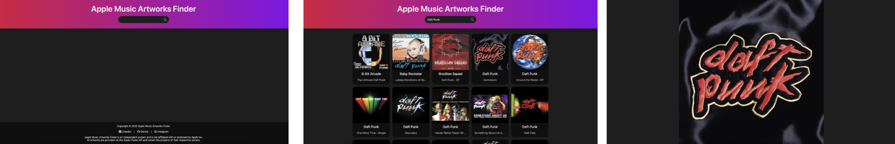

# Apple Music Artworks Finder

## 🔖 Table of contents

<details>
        <summary>
            CLICK TO ENLARGE 😇
        </summary>
        📄 <a href="#description">Description</a>
        <br>
        🎓 <a href="#objectives">Objectives</a>
        <br>
        🔨 <a href="#tech-stack">Tech stack</a>
        <br>
        📂 <a href="#files-description">Files description</a>
        <br>
        💻 <a href="#installation_and_how_to_use">Installation and how to use</a>
        <br>
        🔧 <a href="#whats-next">What's next?</a>
        <br>
        ♥️ <a href="#thanks">Thanks</a>
        <br>
        👷 <a href="#authors">Authors</a>
</details>

## 📄 <span id="description">Description</span>

Apple Music Artworks Finder is a simple tool designed to fetch high-quality album cover artworks from the Apple iTunes API.

This project was inspired by a tool I used when I was younger. I always admired how its developer managed to provide such a useful service, and I found it truly impressive. Wanting to both recreate it for my own use and improve my skills in web development, I thought this would be a great project to practice working with APIs.

The tool allows users to search for album artworks and retrieve them in high resolution, making it particularly useful for those who wish to restore missing or low-quality album covers in their digital music collection.

## 🎓 <span id="objectives">Objectives</span>

- Deepen my understanding of working with external APIs, particularly the iTunes API.
- Ensure a clean and efficient implementation.
- Improve my DOM manipulation skills.
- Practice asynchronous JavaScript (`fetch()` and `async`/`await`).
- Design a modern and responsive user interface.
- Optimize the search experience for speed and accuracy.
- Ensure a smooth and seamless user interaction.

## 🔨 <span id="tech-stack">Tech stack</span>

<p align="left">
    
    
    
    
    
    
    
</p>

## 📂 <span id="files-description">File description</span>

| **FILE**     | **DESCRIPTION**                                     |
| :----------: | --------------------------------------------------- |
| `assets`     | Contains the resources required for the repository. |
| `index.html` | Main HTML structure for the project.                |
| `style.css`  | Styles and animations for the project.              |
| `script.js`  | Behavior script for interactivity.                  |
| `README.md`  | The readme file you are currently reading 😉.      |

## 💻 <span id="installation_and_how_to_use">Installation and how to use</span>

**Installation:**

1. Clone this repository:
    - Open your preferred Terminal.
    - Navigate to the directory where you want to clone the repository.
    - Run the following command:

```
git clone https://github.com/fchavonet/web-apple_music_artworks_finder.git
```

2. Open the repository you've just cloned.

**How to use:**

1. Open the `index.html` file in your web browser.
2. Enter an album title or artist name in the search bar.
3. Click the search button (or press `Enter`).
4. Browse the results and click on an album cover to view or download it in high resolution.

You can also test the web application online by clicking [here](https://fchavonet.github.io/web-apple_music_artworks_finder/).

<p align="center">
    
</p>

## 🔧 <span id="whats-next">What's next?</span>

- Implementing a loading indicator to improve the handling of large images.
- A download button for directly saving high-resolution artworks.
- Light/Dark Mode toggle for better user accessibility.
- Adding the possibility to choose between music and movie artworks.

## ♥️ <span id="thanks">Thanks</span>

- A big thank you to my friends Pierre and Yoann, always available to test and provide feedback on my projects.

## 👷 <span id="authors">Authors</span>

**Fabien CHAVONET**
- Github: [@fchavonet](https://github.com/fchavonet)
