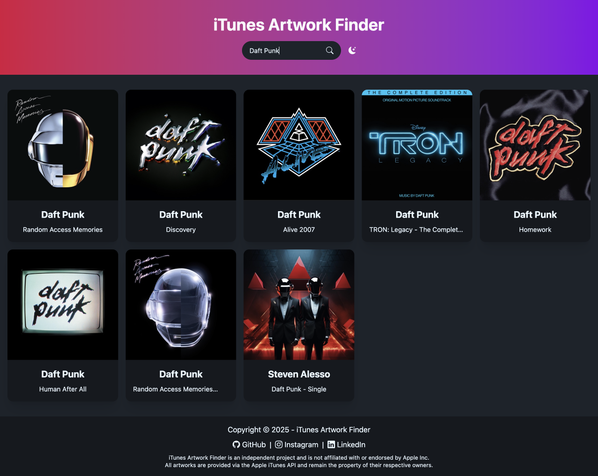
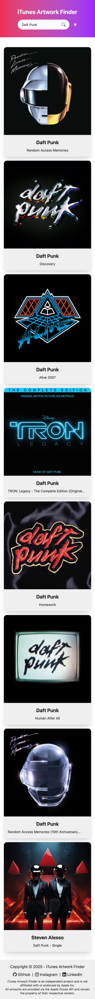

# iTunes Artwork Finder

## Description

iTunes Artwork Finder is a tool designed to fetch high-quality album cover artworks from the Apple iTunes API.

This project was inspired by a tool I used when I was younger. I always admired how its developer managed to provide such a useful service, which I found truly impressive. Wanting to both recreate it for my own use and improve my skills in web development, I thought this would be a great project to practice working with APIs.

The tool allows users to search for album artworks and retrieve them in high resolution, making it ideal for restoring missing or low-quality album covers in their digital music collection.

## Objectives

- Deepen my understanding of working with external APIs, particularly the iTunes API.
- Ensure a clean and efficient implementation.
- Improve my DOM manipulation skills.
- Practice asynchronous JavaScript (`fetch()` and `async`/`await`).
- Design a modern and responsive user interface.
- Optimize the search experience for speed and accuracy.
- Ensure a smooth and seamless user interaction.

## Tech Stack


## File Description

| **FILE**     | **DESCRIPTION**                                     |
| :----------: | --------------------------------------------------- |
| `assets`     | Contains the resources required for the repository. |
| `index.html` | Main HTML structure for the project.                |
| `style.css`  | Styles and animations for the project.              |
| `script.js`  | Behavior script for interactivity.                  |
| `README.md`  | The README file you are currently reading 😉.       |

## Installation & Usage

### Installation

1. Clone this repository:
    - Open your preferred Terminal.
    - Navigate to the directory where you want to clone the repository.
    - Run the following command:

```
git clone https://github.com/fchavonet/web-apple_music_artworks_finder.git
```

2. Open the cloned repository.

### Usage

1. Open the `index.html` file in your browser.

2. Enter an album title or artist name in the search bar.

3. Click the search button (or press `Enter`).

4. Browse the results and click on an album cover to view or download it in high resolution.

You can also test the web application online by clicking [here](https://fchavonet.github.io/full_stack-apple_artworks_finder/).

<table>
    <tr>
        <th align="center" style="text-align: center;">Desktop view</th>
        <th align="center" style="text-align: center;">Mobile view</th>
    </tr>
    <tr valign="top">
        <td align="center">
            <picture>
                <source media="(prefers-color-scheme: dark)" srcset="./assets/images/screenshots/desktop_page_screenshot-dark.webp">
                <source media="(prefers-color-scheme: light)" srcset="./assets/images/screenshots/desktop_page_screenshot-light.webp">
                
            </picture>
        </td>
        <td align="center">
            <picture>
                <source media="(prefers-color-scheme: dark)" srcset="./assets/images/screenshots/mobile_page_screenshot-dark.webp">
                <source media="(prefers-color-scheme: light)" srcset="./assets/images/screenshots/mobile_page_screenshot-light.webp">
                
            </picture>
        </td>
    </tr>
</table>

## What's Next?

- Implement infinite scrolling with no fetch limit.
- Add optional search filters (e.g., artist, genre...).
- Improve caching for faster repeated searches.

## Thanks

- A big thank you to my friends Pierre and Yoann, always available to test and provide feedback on my projects.

## Author(s)

**Fabien CHAVONET**
- GitHub: [@fchavonet](https://github.com/fchavonet)
